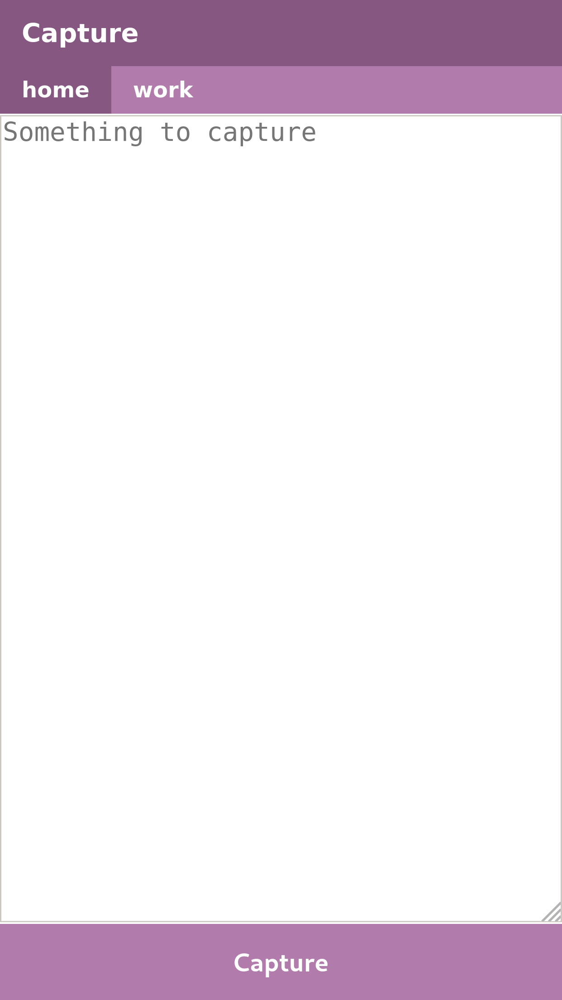

# Capture

Quickly capture notes via a web server.

This repo provides a simple web service that presents a web interface for quickly jotting down notes,
and saves those notes on the web server.

## Building

* install go
* run `go mod vendor`
* run `go build main.go`

## Running

Run `./capture` for instructions.

## Installation

* copy the built binary to `/usr/bin/capture`
* copy `capture.service` to `/etc/systemd/system/`
* copy `templates/index.html` to `/var/lib/uk.jamesm.capture/`
* copy `config.json` to `/etc/uk.jamesm/capture.json`
* set up a reverse proxy to handle the requests

## Configuration

See `./capture help` for usage instructions.

A list of contexts can be defined in `config.json`, which maps context names to filenames.
